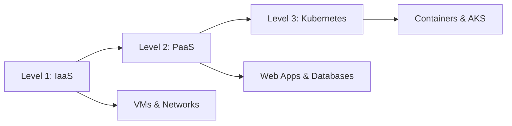

# Azure Training Course - 2025 Edition 🚀

A comprehensive, hands-on Azure training program covering Infrastructure as Code (IaC), Platform as a Service (PaaS), and Kubernetes container orchestration.

## 📚 Course Structure

### Level 1: Azure IaaS Fundamentals
Learn core Azure infrastructure components through practical Terraform deployments:
- **Resource Groups & Tagging**
- **Virtual Networks & Security**
- **Storage & Key Vault**
- **Virtual Machines & Load Balancing**
- **VPN & Network Peering**

### Level 2: Azure PaaS Services  
Build modern cloud applications with Azure PaaS:
- **App Services & Web Apps**
- **Azure SQL Database**
- **Traffic Manager**
- **Application Insights**
- **Automation & Runbooks**

### Level 3: Kubernetes & Containers
Master container orchestration with AKS:
- **Docker & Container Security**
- **Kubernetes Fundamentals**
- **AKS Integration**
- **Helm Charts**
- **Monitoring with Prometheus**

## 🎯 Training Philosophy

- **Code-First Approach**: Write and deploy live infrastructure during sessions
- **Problem-Based Learning**: Learn by solving real deployment challenges
- **Minimal Theory**: 5-10 minute concepts + 1+ hour hands-on workshops
- **Progressive Complexity**: Each level builds on the previous

## 🛠️ Prerequisites

- Azure Subscription (free tier works for most demos)
- Azure CLI installed (`az --version`)
- Terraform >= 1.5.0 (`terraform --version`)
- Docker Desktop (for Level 3)
- kubectl (for Level 3)
- Git

## 🚀 Quick Start

1. **Clone the repository:**
   ```bash
   git clone https://github.com/your-username/azure-training-2025.git
   cd azure-training-2025
   ```

2. **Authenticate with Azure:**
   ```bash
   az login
   az account set --subscription "Your Subscription Name"
   ```

3. **Start with Level 1:**
   ```bash
   cd Level1/artifacts/demo1_resource_group
   terraform init
   terraform plan
   terraform apply
   ```

## 📖 Documentation

- **[CLAUDE.md](CLAUDE.md)** - Detailed guidance for working with this codebase
- **[COURSE-UPDATE-SUMMARY.md](COURSE-UPDATE-SUMMARY.md)** - 2025 modernization details
- **Demo READMEs** - Each demo folder contains specific instructions

## 🔧 Key Technologies

- **Infrastructure**: Terraform 1.5+, Azure Resource Manager
- **Containers**: Docker, Kubernetes 1.28+, Helm 3
- **Languages**: Python 3.11, PowerShell, Bash
- **Monitoring**: Prometheus, Grafana, Application Insights
- **Security**: Microsoft Entra ID, Key Vault, Pod Security Standards

## 📋 Environment Setup

Each level uses Terraform workspaces for environment separation:

```bash
# Create and switch environments
terraform workspace new dev
terraform workspace select dev
terraform apply -var-file=../variables/dev.tfvars

# Available environments
- dev   (Development)
- qa    (Quality Assurance)  
- ops   (Operations/Production)
```

## 🛡️ Security Best Practices

- **No hardcoded credentials** - Use environment variables or Azure Key Vault
- **Least privilege access** - Managed identities where possible
- **Network isolation** - Private endpoints and NSGs
- **Container security** - Non-root users, read-only filesystems

## 📊 Course Progression



## 🤝 Contributing

This is a training course repository. For corrections or improvements:

1. Fork the repository
2. Create a feature branch
3. Make your changes
4. Submit a pull request

## 📝 License

This training material is provided as-is for educational purposes.

## 🆘 Support

- Check the [Issues](https://github.com/your-username/azure-training-2025/issues) section
- Review demo-specific README files
- Consult Azure documentation for service-specific questions

---

**Ready to master Azure? Let's start coding! 💻**